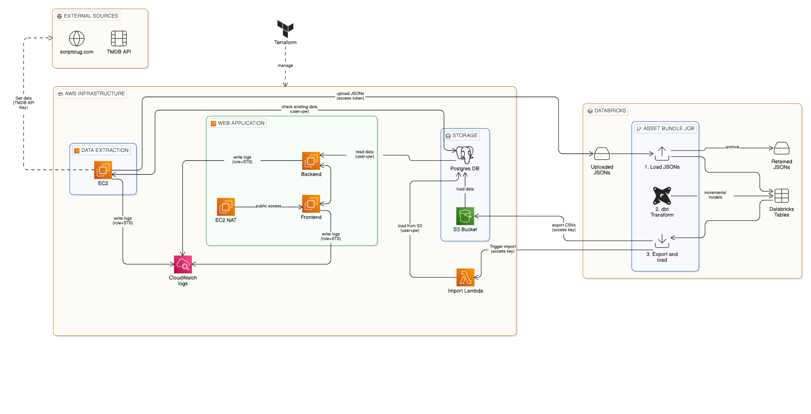

# About
This repository can be used to deploy a web app where we can search movies by dialogues, descriptions, scenes, or other parts of the movie script that couldn't have been classified.

We can also see:
* the characters of movies along with the actor who played them,
* the characters' dialogues,
* what characters an actor played as in what movie,
* and the whole movie script.

The scripts are extracted from https://www.scriptslug.com/, and the TMDB API is used to gather additional information about the movies - for example, its cast.

# System architecture

Most of the resources are compatible with AWS free tier.

Free edition of Databricks is sufficient.

## Extraction

Data is extracted on an EC2 instance into JSON files that are uploaded to a Databricks volume. The EC2 is started on a defined schedule so it can gather data of newly
added movies too. Logs are written to CloudWatch.

## Databricks

We have a Databricks asset bundle with a job that transforms the uploaded data, moves the transformed data as CSV files to S3, then loads them into the Postgres db via
a Lambda function.
The uploaded JSON files are retained in a separate volume.

## Storage

An S3 bucket is used to store the temporary CSV files that are loaded into the Postgres db.

## Web application

Backend and frontend run on EC2 instances. An EC2 NAT instance is used to make the website publicly accessible. Backend gets data from the Postgres db.
Logs are written to CloudWatch.

# Configuration

## Terraform

There are 2 separate Terraform folders:

- infrastructure: this contains the infrastructure resources
- role_for_infrastructure_creation: this contains the resources needed to create the role that will be used to run Terraform in the _infrastructure_ folder

_us-east-1_ AWS region is used in Terraform by default, but it can be changed in the provider block inside the _main.tf_ files and via the _region_ terraform variables.

HCP Terraform is used as backend by default which requires creating the specified workspaces first. See the _terraform.tf_ files.

#### AWS role for infrastructure creation

An AWS role is created that can be assumed only by the GitHub repository we specify as the _github_repo_ variable in _terraform/role\_for\_infrastructure\_creation/terraform.tfvars_.
This role is used to create the infrastructure, and it has only those permissions that are needed to create/destroy the resources.

#### Infrastructure

There are multiple values we can change here, see _terraform/infrastructure/variables.tf_ for details. The following variables are set based on GitHub repository variables (see below):

- pg_database
- pg_user
- pg_password
- deploy_backend_and_frontend

## Github

GitHub secrets required:
- AWS_ACCESS_KEY_ID: needed to create the AWS role for infrastructure creation, and also used by Databricks so it can work with the AWS resources (admin)
- AWS_SECRET_ACCESS_KEY: needed to create the AWS role for infrastructure creation, and also used by Databricks so it can work with the AWS resources (admin)
- DATABRICKS_HOST: needed to upload files to Databricks
- DATABRICKS_TOKEN: needed to authenticate with Databricks (free edition doesn't have OIDC option)
- PG_DATABASE: PostgreSQL database name for the RDS instance
- PG_PASSWORD: PostgreSQL password for the RDS instance
- PG_USER: PostgreSQL username for the RDS instance
- TF_API_TOKEN: needed to authenticate with HCP Terraform
- TMDB_API_KEY: needed to authenticate with TMDB
- MY_IP_CIDR: your public IP in CIDR notation (e.g. 203.0.113.42/32). It is allowed to access the PostgreSQL database.
- FLASK_SECRET_KEY: a random string used as a secret key in the Flask app (backend)

GitHub variables required:
- DATABRICKS_MOVIE_DATA_VOLUME_PATH: where to upload files in Databricks (must be created manually)
- DATABRICKS_SECRET_SCOPE: name for the Databricks secret scope that we use to pass sensitive data to the Databricks asset bundle
- DEPLOY_BACKEND_AND_FRONTEND: whether to deploy the backend and frontend services (true/false)
- GENRES: for testing purposes only. A comma-separated list of genres that the extraction EC2 instance will gather data for (for valid values, see _extraction/src/extract\_movie\_data_).
- NUMBER_OF_MOVIES: for testing purposes only. The number of new (currently not stored) movies to be extracted per genre.
- PG_EXPORT_S3_PATH: the S3 path where the searches exported from the Postgres db will be stored before being loaded into Databricks

## Databricks

We can set in the asset bundle where the dbt models will be stored (_movies\_asset\_bundle/databricks.yml_). The schema name given here will be used in the Postgres db too.

Default values:

- catalog_name: _movies_
- schema_name: _default_
- bronze_schema_name: _bronze_ (the uploaded JSON files are loaded into the _bronze\_json\_movies_ table inside this schema)

We can also set the schedule for the asset bundle job here. By default, it runs once a day.
